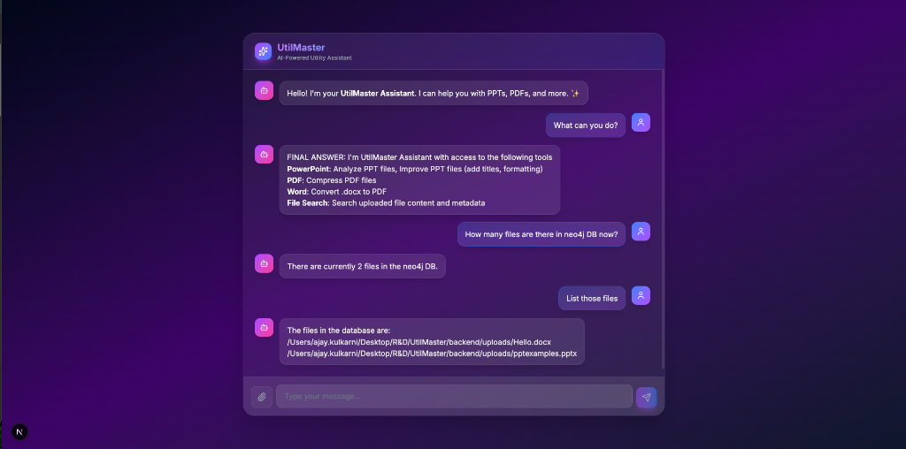

# UtilMaster

> Local-first AI utility platform with multi-agent intelligence and GraphRAG


*UtilMaster's glassmorphism interface showcasing multi-agent capabilities*

## ✨ Features

- **PowerPoint Tools**: Analyze presentations and automatically fix issues
- **PDF Compression**: Reduce file sizes while preserving quality  
- **Word to PDF**: Convert documents instantly
- **GraphRAG**: Search uploaded files using natural language
- **Context-Aware Chat**: Conversational interface with memory

## 🏗️ Architecture

**Multi-Agent System:**
- **Supervisor**: Intelligent request routing
- **PPTAgent**: PowerPoint analysis & improvement
- **WordAgent**: Document conversion
- **PDFAgent**: File compression
- **ChatAgent**: Context-aware conversations with GraphRAG

**GraphRAG Integration:**
- Vector embeddings for semantic search
- Neo4j graph database for relationships
- Hybrid search combining vector + graph queries

## 🛠️ Tech Stack

**Backend:**
- Python 3.12
- LangGraph (Multi-agent orchestration)
- LangChain + Ollama (Llama 3.1 8B)
- Neo4j (Graph database)
- FastAPI

**Frontend:**
- Next.js 15
- TypeScript + React
- Tailwind CSS
- Glassmorphism UI design

## 🚀 Quick Start

### Prerequisites
- Python 3.12+
- Node.js 18+
- Neo4j (local instance)
- Ollama with Llama 3.1 8B

### System Setup

#### 1. Install Neo4j

**macOS (using Homebrew):**
```bash
brew install neo4j

# Start Neo4j
neo4j start

# Access Neo4j Browser
# Visit: http://localhost:7474
```

**Windows/Linux:**
1. Download from: https://neo4j.com/download/
2. Extract and run: `bin/neo4j console`
3. Access: http://localhost:7474

**Initial Setup:**
1. Open http://localhost:7474 in browser
2. Default credentials:
   - Username: `neo4j`
   - Password: `neo4j`
3. You'll be prompted to change the password (remember it!)

#### 2. Install Ollama

**macOS:**
```bash
# Download and install from: https://ollama.ai
# Or via command:
curl -fsSL https://ollama.com/install.sh | sh
```

**Pull required models:**
```bash
# LLM model (Llama 3.1 8B)
ollama pull llama3.1:8b

# Embedding model
ollama pull nomic-embed-text
```

**Verify installation:**
```bash
ollama list
# Should show: llama3.1:8b and nomic-embed-text
```

### Installation

**1. Clone repository**
```bash
git clone https://github.com/akulkarni9/UtilMaster.git
cd UtilMaster
```

**2. Backend setup**
```bash
cd backend

# Create virtual environment
python -m venv venv
source venv/bin/activate  # Windows: venv\Scripts\activate

# Install dependencies
pip install -r requirements.txt

# Configure environment
cp .env.example .env
# Edit .env with your credentials (see below)
```

**3. Configure Environment Variables**

Create `backend/.env`:
```bash
# Neo4j Configuration
NEO4J_URI=bolt://localhost:7687
NEO4J_USER=neo4j
NEO4J_PASSWORD=your_password_here  # Password you set in Neo4j setup

# Ollama Configuration (optional, uses defaults)
OLLAMA_BASE_URL=http://localhost:11434
```

**4. Create .env.example (for reference)**
```bash
cd backend
cat > .env.example << 'EOF'
# Neo4j Database
NEO4J_URI=bolt://localhost:7687
NEO4J_USER=neo4j
NEO4J_PASSWORD=your_neo4j_password

# Ollama LLM
OLLAMA_BASE_URL=http://localhost:11434
EOF
```

**5. Start Backend**
```bash
cd backend
source venv/bin/activate
python server.py
# Should see: Uvicorn running on http://0.0.0.0:8000
```

**6. Frontend setup**
```bash
cd frontend
npm install
npm run dev
# Should see: ready - started server on 0.0.0.0:3000
```

**7. Access application**
- Frontend: http://localhost:3000
- Backend API: http://localhost:8000
- Neo4j Browser: http://localhost:7474

### Verify Setup

**Test Neo4j Connection:**
```bash
cd backend
python -c "
from neo4j import GraphDatabase
uri = 'bolt://localhost:7687'
driver = GraphDatabase.driver(uri, auth=('neo4j', 'your_password'))
driver.verify_connectivity()
print('✅ Neo4j connected!')
"
```

**Test Ollama:**
```bash
curl http://localhost:11434/api/tags
# Should list your installed models
```

## 📖 Documentation

- [LinkedIn Article Part 1](https://www.linkedin.com/pulse/building-utilmaster-local-first-ai-utility-platform-part-kulkarni-fbrvc/) - Architecture & Tech Stack
- [LinkedIn Article Part 2](https://www.linkedin.com/pulse/building-utilmaster-11-phases-from-zero-production-part-ajay-kulkarni-jdsac/) - Development Journey (11 Phases)
- [LinkedIn Article Part 3](https://www.linkedin.com/pulse/building-utilmaster-setup-guide-future-vision-part-33-ajay-kulkarni-ptufc/) - Setup Guide & Future Vision

## 🎯 Use Cases

- **Students**: Analyze presentations, convert documents quickly
- **Professionals**: Compress PDFs before emailing, check slides
- **Researchers**: Search through uploaded documents with AI
- **Anyone**: All common document utilities in one place

## 🔒 Privacy First

- **100% Local**: All processing happens on your machine
- **No Cloud APIs**: Uses local Ollama LLM
- **Your Data**: Files never leave your computer
- **Zero Cost**: No API fees

## 🤝 Contributing

Contributions welcome! Please feel free to submit a Pull Request.

## 📄 License

MIT License - See [LICENSE](LICENSE) file for details

## 👤 Author

**Ajay Kulkarni**
- LinkedIn: [Ajay Kulkarni](https://linkedin.com/in/akulkarni9)
- GitHub: [@akulkarni9](https://github.com/akulkarni9)

---

⭐ If you find UtilMaster useful, please give it a star!

Built with ❤️ using LangGraph, Neo4j, and Next.js
